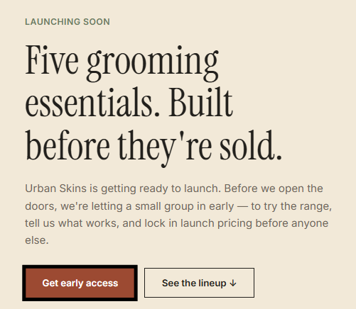
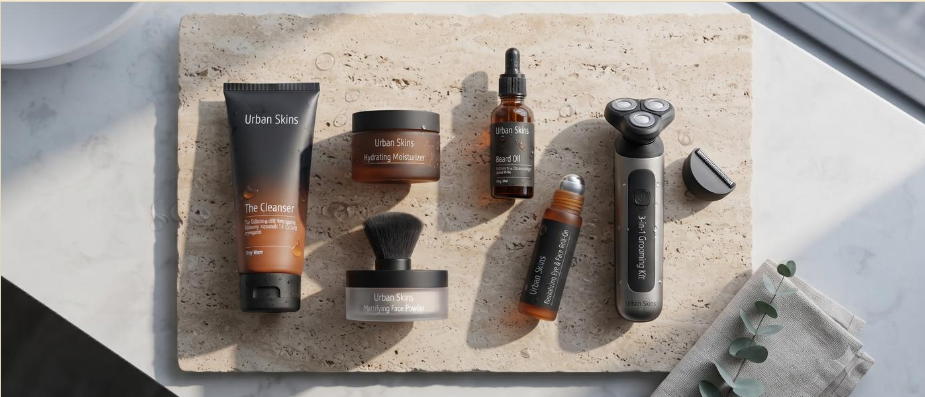
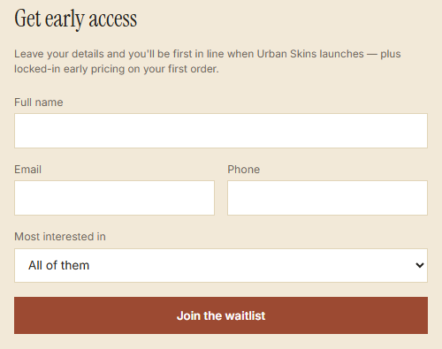
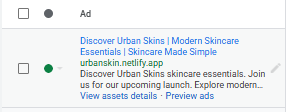
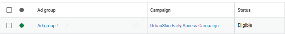

# UrbanSkin – Google Ads Campaign Setup

## 🌐 Live Website

[Visit UrbanSkin Website](https://urbanskin.netlify.app/)

## 📌 Project Overview

UrbanSkin is a self-directed digital marketing project where I created a skincare landing page and set up a Google Ads Search campaign to simulate an end-to-end marketing workflow.

The project focused on building a landing page, generating leads, and planning and configuring a Google Search advertising campaign.

## 🖥️ Website

### Homepage

### Product Lineup

### Lead Generation Form

## 📢 Google Ads Campaign

### Search Advertisement

### Campaign & Ad Group Structure

## 🛠️ What I Did

- Created a skincare landing page
- Designed the product presentation
- Built a lead-generation form
- Conducted keyword research
- Structured Google Ads ad groups
- Created search ad copy
- Configured campaign targeting and budget settings
- Set up lead-generation functionality

## 🧰 Tools Used

- Google Ads
- Google Sheets
- Google Apps Script
- HTML/CSS
- Netlify

## 🎯 Project Objective

To gain hands-on experience in creating a landing page and setting up a Google Ads Search campaign from scratch.

## ⚠️ Disclaimer

This was a self-directed practice project and did not involve paid advertising spend or a real client.
